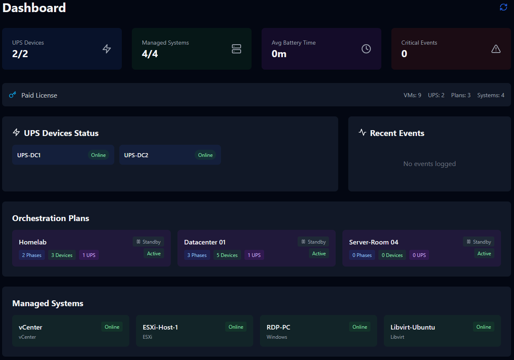

# VM Host Power Manager

[](https://github.com/mainzerp/vmh-powermanager/pkgs/container/vmh-powermanager-backend)
[](https://github.com/mainzerp/vmh-powermanager)
[](LICENSE)

A comprehensive orchestration platform for managing VM and system power states during UPS runtime events. Automatically detects low battery conditions and executes graceful shutdown/startup sequences for your infrastructure.

## Features

### UPS Monitoring
- Real-time SNMP monitoring of UPS devices (APC, CyberPower, etc.)
- Battery runtime, charge level, and input voltage tracking
- Automatic alerts when thresholds are breached
- Support for SNMP v1, v2c, and v3

### Multi-Platform VM Control
| Platform | Capabilities |
|----------|--------------|
| VMware vCenter/ESXi | Full VM power control via API | Functional
| Proxmox VE | VM and container management | Needs testing
| Libvirt/KVM | Direct virsh integration | Functional
| Direct SSH | Custom shutdown commands | Functional

### Orchestration Plans
- Multi-phase execution (sequential and parallel)
- Graceful shutdown with configurable timeouts
- Priority-based VM ordering
- UPS-triggered automatic execution
- Visual execution progress badges

### Security
- JWT-based authentication with TOTP 2FA support
- Role-based access control
- HTTPS with TLS encryption
- Secure SNMP v3 support

## Quick Start

### Prerequisites
- Docker & Docker Compose
- Network access to UPS devices (SNMP)
- Credentials for hypervisors (vCenter, Proxmox, etc.)

### Installation

```bash
# 1. Pull the images
docker pull ghcr.io/mainzerp/vmh-powermanager-backend:latest
docker pull ghcr.io/mainzerp/vmh-powermanager-frontend:latest
docker pull ghcr.io/mainzerp/vmh-powermanager-database:latest

# 2. Download the production compose file
curl -O https://raw.githubusercontent.com/mainzerp/vmh-powermanager/main/docker-compose.prod.yml
curl -O https://raw.githubusercontent.com/mainzerp/vmh-powermanager/main/stack.env.example

# 3. Configure your environment
cp stack.env.example stack.env
# Edit stack.env with your passwords and settings

# 4. Start the application
docker compose -f docker-compose.prod.yml up -d
```

### Initial Setup

```bash
# Create admin user
docker exec -it vmpm-backend python init_admin.py

# Access the application
# https://your-server (default self-signed certificate)
```

## Architecture

```
┌─────────────────────────────────────────────────────────────────┐
│                        Browser (React SPA)                      │
└───────────────────────────────┬─────────────────────────────────┘
                                │ HTTPS / WSS
┌───────────────────────────────▼─────────────────────────────────┐
│                         Nginx Proxy                             │
└───────────────────────────────┬─────────────────────────────────┘
                                │
        ┌───────────────────────┼───────────────────────┐
        ▼                       ▼                       ▼
┌───────────────┐     ┌─────────────────┐     ┌─────────────────┐
│   Frontend    │     │    Backend      │     │  Celery Workers │
│   (React)     │     │   (FastAPI)     │     │  (3 specialized)│
└───────────────┘     └────────┬────────┘     └────────┬────────┘
                               │                       │
        ┌──────────────────────┴───────────────────────┘
        │                      |
┌───────▼───────┐     ┌────────▼────────┐
│  PostgreSQL   │     │     Redis       │
│  (Database)   │     │  (Task Queue)   │
└───────────────┘     └─────────────────┘
```

### Celery Workers

| Worker | Purpose |
|--------|---------|
| **Monitoring** | UPS polling, VM discovery, alert checks |
| **Orchestration** | Plan execution, VM power control |
| **General** | Email/webhook notifications |

## Platform Support

| Architecture | Platforms | Status |
|--------------|-----------|--------|
| **x86_64 / amd64** | Intel/AMD servers, most cloud VMs | ✅ Fully supported |
| **ARM64 / aarch64** | Raspberry Pi 4/5, Apple Silicon, ARM servers | ✅ Fully supported |

## Configuration

Key environment variables in `stack.env`:

```env
# Database
POSTGRES_PASSWORD=your_secure_password

# Security
JWT_SECRET=your_jwt_secret
ENCRYPTION_KEY=encryption_secret

# Worker Concurrency
CELERY_MONITORING_CONCURRENCY=2
CELERY_ORCHESTRATION_CONCURRENCY=2
CELERY_GENERAL_CONCURRENCY=2
```

## Documentation

| Document | Description |
|----------|-------------|
| [User Guide](docs/USER_GUIDE.md) | Frontend user manual |

## Screenshots





## License

This project is proprietary software. All rights reserved.

## Support

For issues and feature requests, please create a GitHub issue.
